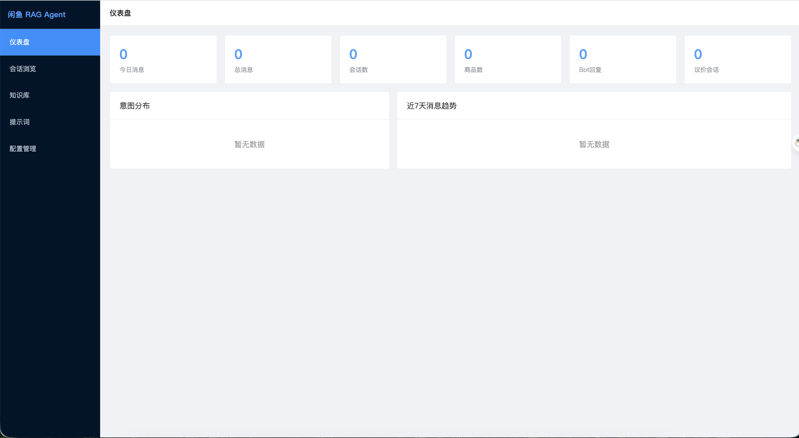
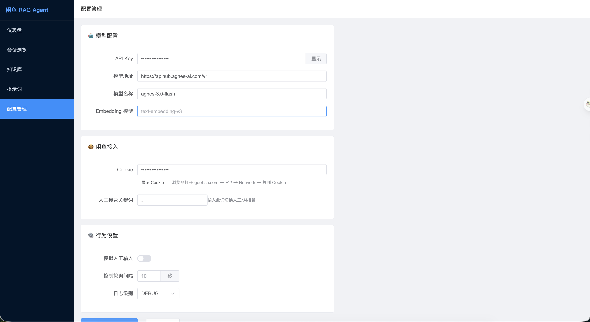
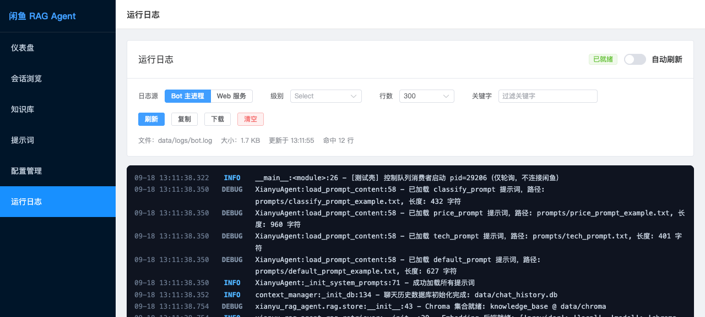
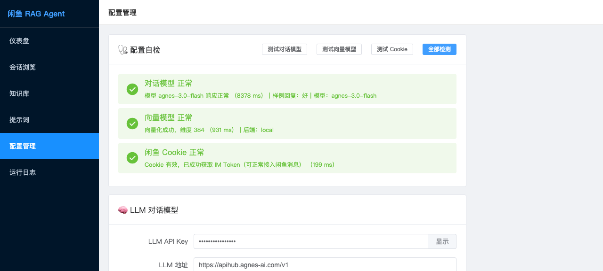

# 🤖 Xianyu RAG Agent — 闲鱼智能客服系统（RAG 知识库 + 可视化平台）

[](https://www.python.org/)
[](https://fastapi.tiangolo.com/)
[](https://vuejs.org/)
[](https://www.trychroma.com/)
[](https://dashscope.aliyun.com/)
[](./LICENSE)

> 基于 LLM 的闲鱼平台 7×24 自动值守方案，集成 **多专家 Agent 路由**、**RAG 知识库检索增强** 与 **全栈可视化管控平台**，让 AI 客服既懂业务、又能管。

---

## 📖 项目简介

Xianyu RAG Agent 是一套闲鱼二手交易平台的智能客服系统。它在「WebSocket 实时消息接入 + LLM 多专家路由回复」的基础之上，新增了 **RAG 检索增强生成** 和 **Web 可视化管控平台** 两大核心模块，解决了原系统「知识不可控、回复无溯源、运维纯靠日志」的三大痛点。

### 它能做什么

| 能力 | 说明 |
|------|------|
| 🔄 **7×24 自动值守** | WebSocket 长连接实时接管闲鱼会话，自动回复买家咨询 |
| 🧭 **多专家 Agent 路由** | 关键词规则 + LLM 意图识别，分发到议价 / 技术 / 客服三个专家 Agent |
| 📚 **RAG 知识库** | 上传店铺 FAQ、商品说明书等文档，技术专家回复时自动检索注入，回复有据可依 |
| 💬 **上下文感知** | SQLite 持久化对话历史，支持议价轮次追踪，LLM 带上下文生成 |
| 🖥️ **可视化平台** | 仪表盘统计 + 会话浏览 + 知识库管理 + 提示词在线编辑热更新 |
| 🔧 **进程间通信** | SQLite 命令队列，Web 平台下发指令 → 主进程轮询执行，零中间件依赖 |
| 🛡️ **优雅降级** | RAG / LLM 异常时自动跳过不影响主流程，系统始终在线 |

---

## 🏗️ 系统架构

```
┌──────────────────────────────────────────────────────────────┐
│                      Bot 主进程 (main.py)                     │
│                                                              │
│  WebSocket 长连接 ←→ 闲鱼 IM                                  │
│       │                                                      │
│       ▼                                                      │
│  消息解密 → 时效过滤 → 人工接管判断                            │
│       │                                                      │
│       ▼                                                      │
│  IntentRouter (关键词规则 + LLM 意图分类)                     │
│       │                                                      │
│   ┌───┼───────────┬──────────────┐                           │
│   ▼   ▼           ▼              ▼                           │
│ PriceAgent  TechAgent   DefaultAgent   ClassifyAgent         │
│ (议价专家)  (技术专家)   (客服专家)     (意图分类)             │
│              │ RAG 检索注入 ↑                                  │
│              └───────┬────────────────────────────┘           │
│                      │                                       │
│  控制队列轮询 (每10s) ← 执行 Web 平台下发的热更新命令          │
└──────────┬───────────────────────┬──────────────────────────┘
           │ 读写                    │ 读写
   ┌───────▼──────────┐     ┌───────▼──────────┐
   │   SQLite          │     │   ChromaDB       │
   │   data/chat.db    │     │   data/chroma/   │
   │                   │     │                  │
   │ • messages        │     │ • 文档向量       │
   │ • items           │     │ • 元数据过滤     │
   │ • rag_documents   │     │ • cosine 检索    │
   │ • control_queue   │     └───────┬──────────┘
   │ • bargain_counts  │             │
   └───────┬──────────┘             │
           │ 读                       │ 读写
┌──────────▼──────────────────────────▼─────────────────────────┐
│                Web 进程 (FastAPI :8000)                        │
│                                                              │
│  ┌──────────┐ ┌────────────┐ ┌──────────┐ ┌──────────────┐  │
│  │ 仪表盘   │ │ 会话浏览    │ │ 知识库   │ │ 提示词管理   │  │
│  │ Dashboard│ │Conversations│ │ RAG CRUD │ │ 热更新       │  │
│  └──────────┘ └────────────┘ └──────────┘ └──────────────┘  │
│                                                              │
│              Vue3 + Element Plus SPA 前端                     │
└──────────────────────────────────────────────────────────────┘
```

### 技术栈

| 层级 | 技术 | 用途 |
|------|------|------|
| **LLM** | DashScope (通义千问) | 对话生成 + 意图分类 + 文本向量化 |
| **Agent** | Python + OpenAI SDK | 多专家路由、RAG 注入、动态温度策略 |
| **向量库** | ChromaDB | 文档向量化存储 + cosine 语义检索 |
| **存储** | SQLite | 对话历史、商品信息、RAG 元数据、命令队列 |
| **后端** | FastAPI + Uvicorn | REST API + 静态文件托管 |
| **前端** | Vue3 + Element Plus | SPA 管理后台（ESM CDN，零构建） |
| **接入** | WebSockets | 闲鱼 IM 实时消息收发 |
| **部署** | Docker Compose | bot + web 双进程容器编排 |

---

## 🚀 快速开始

### 环境要求

- Python 3.10+
- 一个 LLM API Key（默认用阿里云百炼平台 DashScope）

### 1. 克隆 & 安装

```bash
git clone <repo-url>
cd xianyu_rag_agent
pip install -r requirements.txt
```

### 2. 配置环境变量

将 `.env.example` 重命名为 `.env`，填入你的配置：

```bash
# ===== 必配 =====
API_KEY=你的百炼平台API_KEY
COOKIES_STR=闲鱼网页端获取的Cookie
MODEL_BASE_URL=https://dashscope.aliyuncs.com/compatible-mode/v1
MODEL_NAME=qwen-max

# ===== 可选 =====
EMBEDDING_PROVIDER=auto         # auto / local / api / off，见「运维与排障」
EMBEDDING_API_KEY=              # 留空则用本地内置向量模型
EMBEDDING_MODEL=text-embedding-v3
RAG_MAX_DISTANCE=               # 检索相关度阈值，留空自动（在线0.6 / 本地0.75）
TOGGLE_KEYWORDS=。              # 输入句号切换人工接管
SIMULATE_HUMAN_TYPING=False     # 模拟人工回复延迟
CONTROL_POLL_INTERVAL=10        # 控制队列轮询间隔(秒)
LOG_LEVEL=INFO                  # DEBUG 可在网页看到更详细的运行日志
LOG_DIR=data/logs               # 日志目录，网页「运行日志」读取此处
```

> **获取 Cookie**：浏览器打开 [goofish.com](https://www.goofish.com) 登录 → F12 控制台 → Network → 点任意请求 → 复制 Cookie 值
>
> 以上配置都可以不手动改 `.env`，直接在网页 **「配置管理」** 页面填写并保存。

### 3. 启动机器人

```bash
python main.py
```

### 4. 启动可视化平台（另开终端）

```bash
uvicorn web.app:app --host 0.0.0.0 --port 8000
```

浏览器打开 `http://localhost:8000` 即可看到管理后台。

---

## 📚 RAG 知识库使用

### 命令行方式

```bash
# 入库店铺通用知识（退换货政策、发货说明等）
python -m xianyu_rag_agent.rag.cli ingest docs/policy.txt --scope shop --title "退换货政策"

# 入库某商品的专属知识（参数、成色说明等）
python -m xianyu_rag_agent.rag.cli ingest docs/phone.txt --scope item --item-id 123456 --title "iPhone15参数"

# 检索测试
python -m xianyu_rag_agent.rag.cli search "电池续航多久" --item-id 123456

# 查看已入库文档
python -m xianyu_rag_agent.rag.cli list

# 统计信息
python -m xianyu_rag_agent.rag.cli stats
```

### 网页方式

启动可视化平台后，进入 **「知识库」** 页面：
1. 选择文件（支持 .txt / .md）
2. 选择范围（店铺通用 / 指定商品）+ 填写商品 ID + 标题
3. 点击「入库」
4. 下方检索测试框可即时验证召回效果

> 知识入库后，`TechAgent` 处理技术咨询时会自动检索并注入回复，无需重启。

---

## 🖥️ 可视化平台

| 页面 | 功能 |
|------|------|
| **仪表盘** | 今日消息数、总消息、会话数、商品数、Bot 回复数、议价会话数；意图分布进度条；近 7 天消息趋势柱状图 |
| **会话浏览** | 左侧会话列表（搜索 + 分页），右侧消息气泡（区分用户/Bot，Bot 回复带意图标签），显示议价次数和商品信息 |
| **知识库** | 文档上传入库、文档列表删除、检索测试；向量模型可选「在线接口」或「本地内置模型」 |
| **提示词** | 四个 Agent 提示词在线编辑，保存即写文件并触发热更新（主进程 10 秒内自动重载，无需重启） |
| **配置管理** | 在线编辑 LLM / 向量模型 / Cookie / 行为设置，保存即写 `.env`；内置一键连通性自检 |
| **运行日志** | 实时查看 bot / web 两个进程日志，支持级别过滤、关键字搜索、自动刷新、下载与清空 |

---

### 效果展示

<div align="center">
  
  <br>
  <em>图1: 仪表盘 - 消息统计与意图分布</em>
</div>

<br>

<div align="center">
  
  <br>
  <em>图2: 应用信息-配置模型</em>
</div>

<br>

<div align="center">
  
  <br>
  <em>图3: 运行日志 - 实时查看 bot / web 进程日志</em>
</div>

<br>

<div align="center">
  
  <br>
  <em>图4: 配置管理 - 在线改配置 + 一键连通性自检</em>
</div>

---

## 🔍 运维与排障

### 1. 配置自检（推荐第一步）

进入 **「配置管理」** 页面，点击 **全部检测**，会依次验证三项：

| 检测项 | 说明 |
|--------|------|
| 对话模型 | 用当前 `API_KEY` / `MODEL_BASE_URL` / `MODEL_NAME` 发一次最小请求 |
| 向量模型 | 实际做一次向量化，确认 RAG 的 embedding 通道可用 |
| 闲鱼 Cookie | 校验必需字段 → 真实取一次 IM Token（失败会自动走一次 hasLogin 刷新，与 bot 行为一致）|

三项全绿即可放心启动 `python main.py`。

### 2. 向量模型怎么选

RAG 的 embedding 支持两种来源，由 `EMBEDDING_PROVIDER` 控制：

| 取值 | 行为 |
|------|------|
| `auto`（默认）| 填了 `EMBEDDING_API_KEY` 就用在线接口，否则用本地内置模型 |
| `local` | 使用 ChromaDB 内置 ONNX 模型（`all-MiniLM-L6-v2`），完全离线，首次会下载约 80MB |
| `api` | 调用 OpenAI 兼容的 `/embeddings` 接口，需填 `EMBEDDING_API_KEY` |
| `off` | 关闭向量检索 |

> ⚠️ 若对话模型供应商（如 agnes）**不提供** embedding 接口，请保持 `local`，或另填一家向量模型的 Key。
> 本地模型对中文的语义区分度弱于在线模型，生产环境建议配置 DashScope 等在线 embedding；
> 切换后相关度阈值也要跟着调（在线约 `0.6`，本地约 `0.75`，可用 `RAG_MAX_DISTANCE` 覆盖）。

### 3. 日志去哪看

- 网页 **「运行日志」** 页面：分进程（Bot / Web）查看，支持级别、关键字过滤与自动刷新。
- 文件：`data/logs/bot.log`、`data/logs/web.log`（10MB 轮转，保留 10 份）。
- 调整详细程度：配置页把 `LOG_LEVEL` 设为 `DEBUG`，保存后重启 Bot 生效。

### 4. 配置改动如何生效

- **提示词**：保存后写入命令队列，bot 在下一个轮询周期（默认 10s）自动热重载，**无需重启**。
- **`.env` 类配置**：保存后 web 进程立即生效；bot 进程需要重启 —— 页面勾选「保存后重启 Bot」即可，
  容器内由 `restart: always` 拉起，本地运行则由进程自身 `execv` 就地重启。

---

## 🐳 Docker 部署

```bash
# 1) 确保宿主机存在 .env（容器会挂载它，网页改配置也写回这里）
cp .env.example .env && vim .env      # 填 API_KEY 与 COOKIES_STR

# 2) 构建并启动
docker compose up -d --build

# 3) 验证
curl http://localhost:8000/api/health          # {"status":"ok"}
docker compose ps                              # web 应为 healthy
```

启动两个容器：

| 容器 | 职责 |
|------|------|
| **bot** | WebSocket 接入 + Agent 路由 + RAG 检索 + 控制队列轮询 |
| **web** | 可视化平台（FastAPI :8000）|

两者通过共享 `./data`、`./prompts` 卷和 `./.env` 交换数据。浏览器打开 `http://<服务器IP>:8000` 即可。

### 容器环境下的几个关键点

| 事项 | 说明 |
|------|------|
| **镜像已预置本地向量模型** | 构建阶段会预热 `all-MiniLM-L6-v2`（约 80MB），所以 `EMBEDDING_PROVIDER=local` 开箱可用（实测向量化 <1s）；若构建时网络不通，首次使用知识库会重新下载 |
| **重启配置靠 `restart: always`** | 网页保存 `.env` 后下发 `restart_bot`，bot 进程主动退出，由 Docker 拉起新进程；**不要把这个策略改成 `no`** |
| ⚠️ **容器内不能用 SIGTERM 自杀** | 容器里 `python main.py` 就是 **PID 1**，Linux 内核对 PID 1 的默认信号处置是「忽略」，`os.kill(getpid(), SIGTERM)` 会被静默丢弃（表现为：命令 ack 成功但配置从未生效、容器 `RestartCount` 不变）。因此重启走 `os._exit(0)`，另外单独注册了 SIGTERM handler 让 `docker stop` 能优雅退出 |
| **日志不会无限增长** | 应用日志 `data/logs/*.log` 10MB 轮转保留 10 份；容器 stdout 日志限制为 10MB×3 |
| **时区** | 已设 `TZ=Asia/Shanghai`，仪表盘「今日消息」按北京时间统计 |
| **`RUNNING_IN_DOCKER=1`** | 让 bot 用容器重启策略而不是 `execv`；本地运行时不设该变量 |
| **.env 缺失自愈** | 若宿主机没有 `.env`，Docker 会把 bind mount 建成**同名目录**，程序启动时会检测并修掉 |

### 常用运维命令

```bash
docker compose logs -f bot              # 跟 bot 容器输出
docker compose logs -f web
docker compose restart bot              # 改完 .env 想手动重启
tail -f data/logs/bot.log               # 应用日志（也可在网页「运行日志」看）
docker compose down                     # 停止并移除容器（数据保留在 ./data）
docker compose up -d --build            # 代码变更后重新部署
```

> 数据（对话历史、向量库、日志）都在宿主机的 `./data`，`docker compose down` 不会丢；
> 重装容器后直接接着用。

---

## 📁 目录结构

```
xianyu_rag_agent/
├── main.py                     # 机器人主进程入口（WebSocket + 消息处理 + 控制轮询）
├── XianyuAgent.py              # 多专家 Agent 引擎（路由 + RAG 注入 + 动态温度）
├── XianyuApis.py               # 闲鱼 HTTP API 封装（Token / 商品信息）
├── context_manager.py          # SQLite 上下文管理（对话/商品/RAG元数据/命令队列）
├── xianyu_rag_agent/           # RAG 知识库模块
│   └── rag/
│       ├── store.py            #   ChromaDB 向量库封装
│       ├── chunker.py          #   文档切分（空行分段 + 短段合并 + 滑动窗口）
│       ├── embedder.py         #   Embedding 后端（在线 API / 本地 ONNX 可切换）
│       ├── retriever.py        #   RAGRetriever（embedding + 检索 + 入库）
│       └── cli.py              #   命令行工具
├── web/                        # 可视化平台
│   ├── app.py                  #   FastAPI 入口
│   ├── deps.py                 #   共享依赖（单例管理 + RAG 热重建）
│   ├── selftest.py             #   模型 / 向量模型 / Cookie 连通性自检
│   ├── routers/                #   API 路由
│   │   ├── dashboard.py        #     仪表盘统计
│   │   ├── conversations.py    #     会话浏览
│   │   ├── rag.py              #     知识库 CRUD
│   │   ├── prompts.py          #     提示词管理
│   │   ├── config.py           #     .env 在线配置 + 自检接口
│   │   └── logs.py             #     运行日志读取
│   └── static/                 #   Vue3 前端（ESM CDN）
│       ├── index.html
│       └── js/
│           ├── app.js          #     主应用 + hash 路由
│           ├── api.js          #     API 客户端
│           └── views/          #     六个页面组件
├── prompts/                    # Agent 提示词模板
├── utils/                      # 闲鱼工具函数（签名/Cookie/解密）+ 日志配置
├── data/                       # 运行时数据（SQLite + ChromaDB + logs）
├── Dockerfile
├── docker-compose.yml
├── requirements.txt
└── .env.example
```

---

## 🔧 提示词自定义

编辑 `prompts/` 目录下的文件即可定制各专家的行为：

| 文件 | 专家 | 职责 |
|------|------|------|
| `classify_prompt.txt` | 意图分类器 | 判断消息归属 price/tech/default/no_reply |
| `price_prompt.txt` | 议价专家 | 阶梯让步策略，守价格底线 |
| `tech_prompt.txt` | 技术专家 | 参数解读 + RAG 知识注入 |
| `default_prompt.txt` | 客服专家 | 物流/售后/日常咨询 |

也可通过可视化平台的 **提示词** 页面在线编辑，保存后自动热更新。

---

## 📄 License

[MIT License](./LICENSE)
